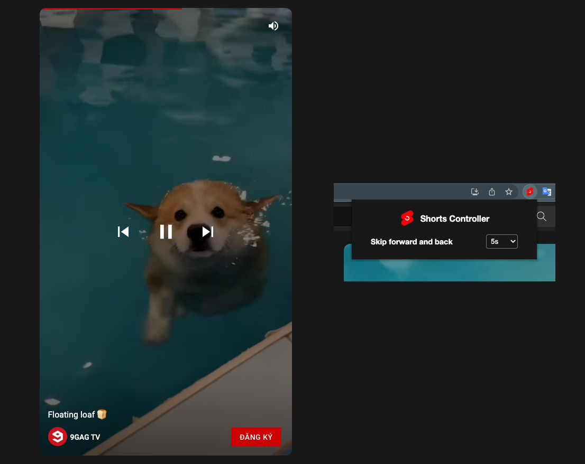

<h1 align="center">

Youtube Shorts Controller
</h1>

  <a href="https://chrome.google.com/webstore/detail/fbkgbegeloakaicldjgkamfmpjhlmibi">
    
  
  

  

## Overview

- A browser extension which adds control buttons and processbar to Youtube Shorts player
- Support Chromium Browsers and Firefox.

  

## Installation

- For other Chromium browser:
   
  Download from <a href="https://github.com/misa198/youtube-shorts-controller/releases">
  here
  </a> and follow the instructions [here](https://www.quora.com/How-do-I-install-a-chrome-extension-from-a-zip-file).

## License

[MIT](./LICENSE)

## Support me

